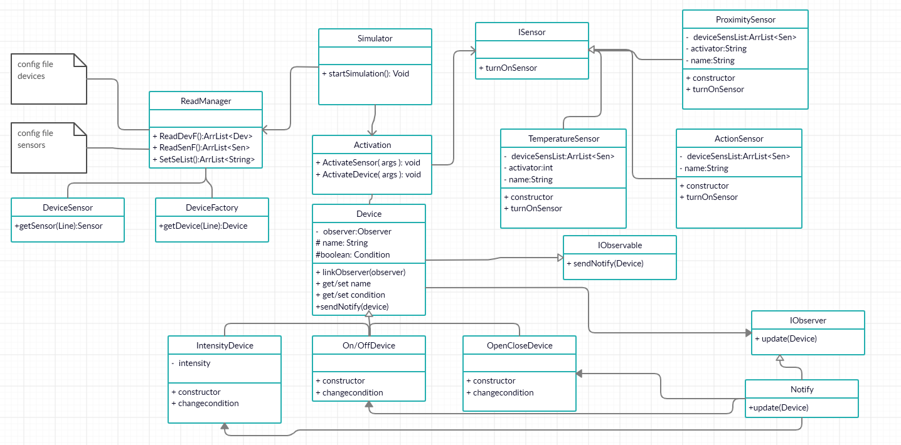

# JALA-DOMOTICA
##Objectives: 
- Application of knowledge about program object oriented.
- Make an application to manage smart house devices and sensors.
##Description:
The smart home is composed of electronic devices and sensors, where the devices of the
housing react according to the signals sent by the sensors.
The following points are required:
- The app is loaded from a configuration file where the information of the
devices and sessions.
- Any change in this file will be reflected in the app, for example: Change the status of a
sensor to notify your subscribed devices.  
##DiagramClass:

##Simulation example:
I Arrive at house I open the front door  
Front door open sensor activation  
#####Devices to active:
lightsLivingRoom,on,75  
livingRoomTv,on  
airConditioning,on,25  
livingRoomWindow,open  
livingRoomCurtains,open
  
I want to dinner, I Manually set the dinner mode  
Mode dinner activates
#####Devices to active:
lightsLivingRoom,off,75  
lightsKitchen,on,95  
radio,on  
coffeeMaker,on  
livingRoomTv,off  
kitchenWindow,open  

it starts to get hot I turn off the air conditioning
deactivate - "airConditioning",deviceDataList,false,17  

I want to watch a movie, I Manually set the cinema mode
Mode cinema activates:
#####Devices to active:
lightsKitchen,off,95
radio,off
livingRoomTv,on
livingRoomWindow,close
livingRoomCurtains,close

It start to get cold, automatically the temperature sensor turns on  
activate - deviceDataList,"temperatureTurnOn",sensorList,17

